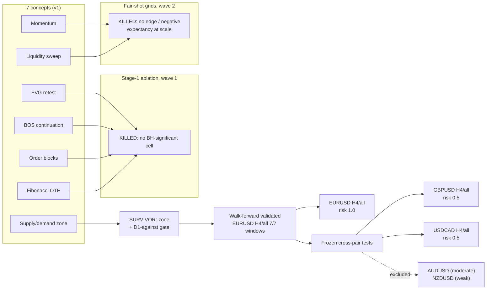
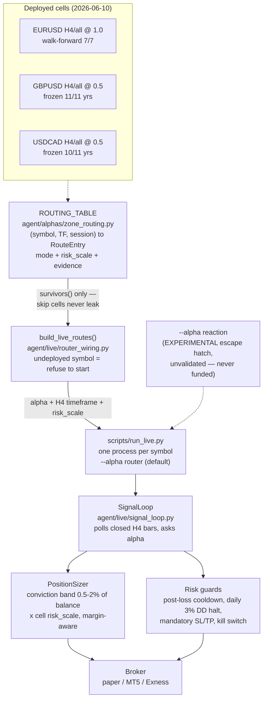

# 00 — The Journey: from ICT trading partner to a validated zone-fade portfolio

**Last updated:** 2026-07-22 (charter elevation D081)
**Companion:** [CHECKPOINT.md](CHECKPOINT.md) (current-state snapshot, updated at every
major divergence). Evidence record: [`reviews/`](reviews/).

**2026-07-22 · Company charter elevated (D081–D086, evolution
integration).** CEO directive: real product / real users / literature-
standard R&D. Two new roles activated: **Research Lead** ("The Anri
Junior", executive-adjacent, dual-report CTO+CPO; owns the E0xx +
M0xx portfolio and the `/research` verdict manifest) and **User
Advocate** (business tier, no persona; owns feedback intake, weekly
triage brief for CPO, GDPR/CCPA hygiene). Two new protocols land:
`company/protocols/rd-loop.md` (intake ID `I###`, Monday drain
cadence, cross-repo bridge into `finance-research-experiments`) and
`company/protocols/literature-standards.md` (pre-registration + FDR
budget + reproducibility + honest negatives + citation discipline +
five non-negotiables that pull a claim). Escalation protocol gains
§6 (suppression of a research negative). Review chain gains stage
7b (`research`, conditional on CTO flag `research_relevant: true`).
Ledger grows: two role rows (17 → 19), three KPIs
(`intake_items_open`, `experiments_in_flight`,
`published_findings_last_30d`), two top-level arrays (`intake`,
`experiments`) seeded with I001 (Sprint 1 honest-review flag) and
two experiments (M001-PhaseAC negative, F013 30-day approval-rate).
`/hq` grows an R&D pulse section between Sprint Kanban and Role
grid; `_BASE_CSS_VERSION 1.0.0 → 1.1.0` (additive tokens). Six new
`D###` decisions (D081–D086). Test suite 1483 → 1503 (+20). Zero
diffs to `agent/live/*`, `agent/risk/*`, `agent/squad/*` (D065
Invariant #2 preserved). Zero spend. Applies on top of Sprint 2
close-out at `ecf6331`.

**2026-07-22 · Sprint 2 (Real-Trading) complete.** Six P0 features
shipped on `product` in a single autonomous executor day: F009 (auth
hardening — per-token rate limit + session expiry + rotation), F010
(claim-register audit tooling + pre-commit hook), F011 (kill-switches
infrastructure — global + per-symbol + hot-reload + audit-jsonl),
F012 (risk budget hard-cap + broker connection health + `/risk`
dashboard), F013 (trade approval mode + `/approvals` queue +
live-mode toggle with 3-part ceremony), F014 (SSE alerts stream +
Telegram bridge + `/alerts`). Everything default-OFF per D065:
`live_mode_enabled` defaults False at every layer, the Telegram
bridge defaults disabled, and no live pathway calls
`approval_queue.submit(...)` — Sprint 2 is scaffolding, not the
switch. The P0 invariant lives at
`tests/security/test_live_mode_off_invariant.py` (6 cases green): no
live order can be sent unless FOUR gates all pass
(`live_mode_enabled` AND `not kill_switches.is_killed()` AND
`risk_budget.can_send_order()` AND `approval_queue.can_send_order()`).
Zero diffs to `agent/live/*`, `agent/risk/*`, `agent/squad/*` (D065
Invariant #2). Platform test suite 1259 → 1482 (+223); security
suite 132 → 204 (+72). Sprint verdict COMPLETE, zero blockers, zero
spend. Commit range `242ac98..1303ca4`. See
`company/sprints/sprint-2-real-trading/REPORT.md` for the post-mortem
and Sprint 3 (Stickiness) retro suggestions.

**2026-07-21 · Sprint 1 (Access) complete.** Three P0 features shipped
on `product` in a single autonomous executor day: F006 (encrypted
credential storage + install-scoped auth), F007 (MT5 broker connection
wizard with sandbox-default + two-gate live confirmation), F008
(first-time setup / onboarding flow + `/settings/reset-install`).
Retro amendments landed FIRST per D047: review-chain §3.5 F005-first
serialisation, §4.2 spec-lock validation, §5.5 `_BASE_CSS_VERSION` tag,
§6.3 automated Legal claim-register audit. Platform test suite
974 → 1259 (+285); security suite populated for the first time (132
tests). Sprint verdict COMPLETE, zero blockers, zero spend. Commit
range `635c9bd..<F008 close-out>`. See
`company/sprints/sprint-1-access/REPORT.md` for the post-mortem and
Sprint 2 (Real-Trading) retro suggestions.

**2026-07-21 · Sprint 0 (Trust Foundation) complete.** Company scaffold
(`company/`) landed on the `product` branch; five P0 features (F001
`/performance`, F002 `/players[/:id]`, F003 `/research`, F004 mobile
pass, F005 shared skeleton + error helper) shipped in a single
autonomous executor session. Platform test suite 100 → 348 (+248).
Sprint verdict COMPLETE, zero blockers, zero spend. Commit range
`a8f0990..<F004 close-out>`. See
`company/sprints/sprint-0-trust-foundation/REPORT.md` for the
post-mortem and Sprint 1 retro suggestions. `product` branch now
carries the customer-facing surface; `main` still holds the research
lane and `next-gen` the v2 squad runtime.

This document is the narrative source of truth for how the project got from a
many-concepts-at-once "AI trading partner" to a small, statistically-validated,
multi-symbol deployment. Read it before touching strategy code: every elimination
below was paid for with data, and re-introducing a buried concept without new
evidence repeats a mistake we already made.

---

## 1. The v1 era: the ICT trading partner (and why it died)

v1 set out to codify a discretionary ICT trading style for EURUSD as a "trading
partner": many concepts running at once — liquidity sweeps, fair value gaps (FVG),
break of structure (BOS), supply/demand zones, order blocks, momentum, fibonacci
OTE — stacked behind gate profiles, an ML scorer, a confluence optimizer, a
present-time **Reaction Engine** for impulsive moves, ERL/IRL liquidity magnets,
and HTF context.

It produced impressive-looking in-sample numbers and degraded into noise out of
sample ("trash results"). The root cause was not any single bug (although bugs were
found — including an FVG fill-state look-ahead that manufactured a fake 100% win
rate): it was **accumulated complexity and implicit overfitting**. Every
keep/drop/threshold decision made by staring at the same backtest window silently
turned that window into training data. With ~7 interacting concepts, gate
profiles, and tuned thresholds, the system had enough degrees of freedom to fit
anything and predict nothing.

## 2. The reset (2026-06-09)

We deleted logs, trained model weights, and result artifacts to prevent peeking
(the v2 reset — see [`audit/README.md`](audit/README.md) for the full burn list),
and adopted a strict **stage-1 ablation methodology**:

- Each concept is tested **ALONE** — one alpha, one timeframe, one session per
  cell. No ensembles, no confluence, no ML until a concept earns it.
- Grid axes: timeframes **D1, H4, H1, M15, M5** × sessions **all, london, ny,
  london_ny_overlap, asia**.
- Statistics: **bootstrap p-values** per cell, with **Benjamini-Hochberg FDR
  correction at 5% across the whole grid** — so running many cells can't
  manufacture significance.
- Honest plumbing: a modular `Alpha` interface (`agent/alphas/`), the
  `AblationCell` grid harness (`agent/alphas/grid.py`), an isolated fill-model
  backtest, `PrecomputedContext` detectors, and **per-timeframe realistic costs**.

## 3. The elimination funnel

Run through the grid with a fair shot each, the v1 concepts fell one by one:

| Concept | Verdict | Why |
|---|---|---|
| FVG retest | eliminated (first wave) | no BH-significant cell |
| BOS continuation | eliminated (first wave) | no BH-significant cell |
| Order blocks | eliminated (first wave) | no BH-significant cell |
| Fibonacci (OTE) | eliminated (first wave) | no BH-significant cell |
| Momentum | eliminated (second wave) | fair-shot grid: no BH-significant edge / negative expectancy at scale |
| Liquidity sweep | eliminated (second wave) | fair-shot grid: no BH-significant edge / negative expectancy at scale |
| **Supply/demand zone** | **sole survivor** | BH-significant cells survived the full grid |

The sole survivor was `SupplyDemandAlpha` ("zone").

## 4. The HTF discovery: the zone edge is mean-reversion

Probing the survivor revealed its character: the zone edge is **mean-reversion**.
Gating entries **AGAINST the D1 trend** (`htf_align="D1"`, mode `"against"`,
lookback 10, min move 60 pips) *strengthened* it; trading **WITH** the D1 trend
*destroyed* it. The configuration was named **`zone_d1_against`** — fade an H4
supply/demand zone touch counter to the prevailing D1 trend.

## 5. The performance overhaul (what made the grids affordable)

Full-history grids across 5 TFs × 5 sessions were too slow until a measured
optimization pass, each change validated with equivalence tests:

| Optimization | Speedup |
|---|---|
| `detect_liquidity_sweeps` (bisect-based) | ~133× |
| `detect_bos` (cursor-based) | ~234× |
| Grid memoization | ~6× |
| `auto_fib` removal from precompute | ~70× (M15) |
| **Overall H1 precompute** | **~900×** |

## 6. The validation gauntlet (where selection bias was caught — twice)

### 6.1 Definitive zone grid (full window)

`scripts/run_zone_all_tfs.py` over 2015–2025: **13 BH-significant cells**. But the
full window was in-sample to the selection process, so this was a candidate list,
not a deployment list.

### 6.2 Holdout validation — the first selection-bias lesson

`scripts/run_holdout_validation.py` split IS 2015–2022 / OOS 2023–2025. Of 8
IS-survivors, **only 1 validated OOS**: `zone_d1_against / H4 / asia`. The big D1
cells collapsed (+25 expectancy IS → +1 OOS). Lesson: picking the best cells on a
window and expecting them to repeat **is** selection bias.

### 6.3 Walk-forward — the second selection-bias lesson

`scripts/run_walk_forward.py` (7 rolling 4yr-IS / 1yr-OOS windows) showed the
**Asia-only restriction was itself selection bias** from the single holdout split.
`zone_d1_against / H4 / ALL sessions` posted **positive OOS expectancy in 7/7
windows**, median **+11.34/trade**, ~66 trades/yr — same per-trade edge as the
Asia subset with 4× the sample. It became the deployed cell.
Evidence: [`reviews/walk_forward_raw.json`](reviews/walk_forward_raw.json),
analysis `scripts/analyze_walk_forward.py`, write-up
[`reviews/2026-06-09_walk_forward.md`](reviews/2026-06-09_walk_forward.md).

### 6.4 Sealed 2026 first look

The held-out Jan–Jun 2026 window (per `EvalConfig`): **16 trades, +7.75/trade,
+124 total, p=0.29** — directionally consistent, statistically inconclusive
(expected at this sample size). Monitoring continues.

### 6.5 Frozen cross-pair tests — the strongest evidence

`scripts/run_cross_pair_frozen.py` ran the deployed config **byte-for-byte, zero
re-tuning**, on pairs the pipeline had never touched, with costs scaled **UP**:

| Pair | H4 exp/trade | Sharpe | p | Positive years | Verdict |
|---|---|---|---|---|---|
| GBPUSD | +10.24 | 2.42 | 0.001 | 11/11 | deploy at half risk |
| USDCAD | +4.63 | 1.16 | 0.028 | 10/11 | deploy at half risk |
| AUDUSD | +3.45 | 1.15 | 0.032 | 8/11 | MODERATE — excluded |
| NZDUSD | +2.47 | 0.85 | 0.096 | 6/11 | WEAK — excluded |

Because nothing was fit to these pairs, their entire 2015–2025 history is
out-of-sample — this cannot be overfitting. **Verdict: the H4 zone-fade edge is
structural FX behaviour, not an EURUSD quirk.** D1 was weak cross-pair, so the
EURUSD D1 candidate was NOT promoted. Write-ups:
[`reviews/2026-06-10_cross_pair_frozen.md`](reviews/2026-06-10_cross_pair_frozen.md),
[`reviews/2026-06-10_similar_pairs_frozen.md`](reviews/2026-06-10_similar_pairs_frozen.md).

## 7. Deployment: router + live wiring

- **Multi-symbol router** (`agent/alphas/zone_routing.py`): keys
  `(symbol, timeframe, session)` → `RouteEntry(mode, risk_scale, evidence)` where
  every evidence record carries a source tag (`walk_forward` /
  `frozen_cross_pair`). Deployed cells: **EURUSD/H4/all @ risk 1.0**,
  **GBPUSD/H4/all @ risk 0.5**, **USDCAD/H4/all @ risk 0.5**. Candidate (tracked,
  never routed): EURUSD/D1/all. Contract tests: `tests/test_zone_routing.py`.
- **Live wiring** (`agent/live/router_wiring.py`, `scripts/run_live.py`):
  `run_live` defaults to the router — the routing table fixes the alpha, the H4
  timeframe, and the `risk_scale` fed into the `PositionSizer`. Undeployed
  symbols **refuse to start**. The old `ReactionAlpha` is demoted to an explicit
  `--alpha reaction` escape hatch (unvalidated/experimental — never on a funded
  account).
- **Adaptive sizing**: conviction band 0.5–2% of live balance × the cell's
  `risk_scale`, margin/leverage aware.
- **259 tests pass.**

## 8. Parked / future work

| Item | Status | Notes |
|---|---|---|
| EURUSD D1 candidate promotion | parked | needs more OOS years (post-2025); cross-pair D1 weakness argues against early promotion |
| The "vault" | idea | archive hypotheses from losses with regime-similarity recall; anything recalled must graduate via the full statistical pipeline — never auto-deployed, never on EURUSD's exhausted data |
| FVG / liquidity-sweep revisit | deferred | as *confluence filters* on fresh pair data only; cross-pair review recommended deferring to preserve fresh-data evidentiary value |
| Live trade journal + live-vs-backtest distribution monitor | next | detect divergence between live fills and the validated backtest distribution |
| Portfolio USD-exposure manager | next | the 3 pairs are correlated: EURUSD long + GBPUSD long + USDCAD short ≈ one "USD down" bet, ~4% worst-case combined risk; bounded today by per-trade caps + the shared 3% daily-DD account guard |

---

## The path, as a map

Divergence points are marked ◆ — each one is where the routine in
[CHECKPOINT.md](CHECKPOINT.md) should run.

```mermaid
flowchart TD
    V1["v1: ICT trading partner<br/>7+ concepts stacked: sweeps, FVG, BOS,<br/>zones, order blocks, momentum, fibs<br/>+ Reaction Engine, ERL/IRL, ML scorer"]
    V1 -->|"results degrade to noise<br/>(accumulated overfitting)"| RESET

    RESET["◆ THE RESET (2026-06-09)<br/>delete logs / weights / results<br/>adopt stage-1 ablation + BH-FDR 5%"]
    RESET --> GRID

    GRID["Ablation grid<br/>each concept ALONE<br/>5 TFs x 5 sessions, bootstrap p-values"]
    GRID -->|"eliminated: FVG, BOS,<br/>order blocks, fibs"| GRID2
    GRID2["Fair-shot grids round 2"]
    GRID2 -->|"eliminated: momentum,<br/>liquidity sweep"| ZONE

    ZONE["◆ ZONE-ONLY<br/>sole survivor: SupplyDemandAlpha<br/>discovery: edge is mean-reversion,<br/>gate AGAINST D1 trend = zone_d1_against"]
    ZONE --> FULLGRID

    FULLGRID["Definitive zone grid 2015-2025<br/>13 BH-significant cells"]
    FULLGRID --> HOLDOUT

    HOLDOUT["Holdout IS 2015-2022 / OOS 2023-2025<br/>only 1 of 8 IS-survivors validates:<br/>zone_d1_against / H4 / asia"]
    HOLDOUT -->|"big D1 cells collapse<br/>+25 IS to +1 OOS:<br/>selection-bias lesson #1"| DETOUR

    DETOUR["◆ SESSION-RESTRICTION DETOUR<br/>deployed H4/asia only"]
    DETOUR --> WF

    WF["◆ WALK-FORWARD CORRECTION<br/>7 rolling 4yr-IS / 1yr-OOS windows:<br/>Asia-only was selection bias #2<br/>H4/ALL: 7/7 windows positive, +11.34 median"]
    WF --> SEALED

    SEALED["Sealed 2026 first look<br/>16 trades, +7.75/trade, p=0.29<br/>consistent but inconclusive"]
    SEALED --> CROSS

    CROSS["◆ CROSS-PAIR EXPANSION<br/>frozen tests, zero re-tuning, costs UP:<br/>GBPUSD 11/11 yrs p=0.001 - deploy 0.5x<br/>USDCAD 10/11 yrs p=0.028 - deploy 0.5x<br/>AUDUSD MODERATE / NZDUSD WEAK - excluded<br/>D1 weak cross-pair - candidate NOT promoted"]
    CROSS --> NOW

    NOW["TODAY (2026-06-10)<br/>multi-symbol router + live wiring<br/>3 deployed cells, 259 tests green"]
```

## The elimination funnel

## Current deployment architecture

---

## Lessons the project paid for (do not relearn these)

1. **Complexity is overfitting fuel.** Seven interacting concepts with tuned
   gates can fit any history. One concept per cell, tested alone, is the only
   honest read.
2. **Selection bias hides in restrictions, not just parameters.** The Asia-only
   deployment looked like rigour (it survived a holdout!) and was still an
   artifact of a single split. Walk-forward across windows caught it.
3. **The strongest evidence is the test you couldn't have rigged.** Frozen
   cross-pair runs with zero re-tuning and scaled-up costs cannot overfit —
   nothing was fit.
4. **Per-window p-values are underpowered at ~15 trades/yr.** Consistency of
   positive OOS expectancy across windows is the robustness signal; per-window
   significance is gravy.
5. **Burn what you've peeked at.** Looking at a window spends it. The sealed-test
   and fresh-pair budgets are finite resources — spend them deliberately.
