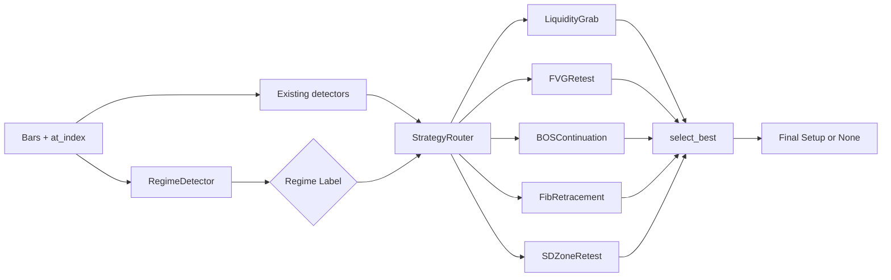

# Regime-Aware Strategy Router — Design Doc

**Status:** scaffolded (modules exist, not yet wired into the rule engine).
**Owner:** the1finix.
**Last updated:** 2026-05-03.

---

## 1. Problem

The 3-year out-of-sample run on EURUSD (`data/agent_3yr_v5_M15H1.db`,
2023-05 through 2026-05) closed at **-37.6 %** with a 41.4 % win rate
across **769** trades. The audit ledger
(`tmp/audit_3yr_v5.json`) shows the bleed is *not* uniform — it
concentrates in three orthogonal dimensions:

1. **Time-of-day** — NY hours 03, 04, 12 and 13 are statistically
  significant losers (-448 / -214 / -402 / -857 pips respectively). The
   12-13 NY block is news-driven; 03-04 is London-open chop.
2. **Confluence stack** — bare `bos` or bare `zone` setups bled, while
  `fvg + sweep + zone` and `fvg + phase_distribution + zone` printed
   80-90 % WR. Same engine, same risk, completely different expectancy.
3. **Volatility regime** — chop weeks (ATR14/ATR50 < 0.7) lost 2.3× more
  per trade than trend weeks even when the signal stack was identical.

Layered rule-of-thumb gates have already extracted the obvious first cut
(see `RulesConfig.precision_partner_tags`, `blocked_hours_ny`,
`require_structural_anchor`). The next step is structural: **stop
forcing one strategy onto every market**, and instead route each bar
through the strategy that historically performs best in the regime it
just observed.

---

## 2. Architecture

```
                                       +--------------------+
                                       |  RegimeDetector    |
                                       |  (cheap features)  |
                                       +----------+---------+
                                                  |
                                            RegimeLabel
                                                  |
                                                  v
+-----------------------+               +--------------------+
| Existing detectors    |   ctx +       |  StrategyRouter    |
| (zones, FVG, BOS,     +-------------->|                    |
|  sweeps, fib, ...)    |   index       |  - registry        |
+-----------------------+               |  - bandit weights  |
                                        +----------+---------+
                                                   |
                          +------------+-----------+-----------+------------+
                          v            v           v           v            v
                   LiquidityGrab  FVGRetest   BOSContinuation  Fib...   SDZone...
                   (Strategy)    (Strategy)   (Strategy)              (Strategy)
                          \             |            |            |       /
                           \            |            |            |      /
                            v           v            v            v     v
                                            Setup candidates
                                                   |
                                                   v
                                       Router.select_best()
                                                   |
                                                   v
                                         Final Setup (or None)
                                                   |
                                                   v
                                       Risk-mgr / Backtester
```

Mermaid version (for the dashboard):




---

## 3. Regime taxonomy

The `RegimeLabel` returned by `RegimeDetector` carries three orthogonal
axes that the audit said matter:


| Axis          | Values                                                            | Source                                  |
| ------------- | ----------------------------------------------------------------- | --------------------------------------- |
| `primary`     | `trending_up` / `trending_down` / `chop` / `low_vol` / `high_vol` | 50-bar slope + ATR14/ATR50 ratio        |
| `session`     | `asia` / `london` / `ny` / `overlap` / `off`                      | NY local hour                           |
| `kill_zone`   | `bool`                                                            | `session in {london, ny, overlap}`      |
| `news_window` | `bool`                                                            | `agent.news.is_news_blackout(now, ...)` |


These are deliberately cheap to compute (no scikit-learn, no warmup
weights). A precise per-bar label only needs ~50 bars of history, so the
detector is safe to call on each backtest bar without perf concerns.

### 3.1 Primary regime cut-offs


| Label           | Slope (pips / 50 bars) | ATR14 / ATR50 | Notes                                 |
| --------------- | ---------------------- | ------------- | ------------------------------------- |
| `trending_up`   | > +3                   | any           | Strong impulse up                     |
| `trending_down` | < -3                   | any           | Strong impulse down                   |
| `high_vol`      | abs(slope) <= 3        | > 1.4         | Chop *and* expansion — news / overlap |
| `low_vol`       | abs(slope) <= 3        | < 0.7         | Asia / off-session creep              |
| `chop`          | abs(slope) <= 3        | 0.7-1.4       | Default range condition               |


Cutoffs are deliberately wide — the goal is to *steer* the router, not
classify exactly. Per-strategy WR within each bucket comes from the
journal at runtime.

### 3.2 Session derivation

Session is derived from NY-local hour to keep it consistent with the
existing `blocked_hours_ny` gate:


| NY hour | Session     |
| ------- | ----------- |
| 02-04   | `london`    |
| 05-07   | `london`    |
| 08-12   | `overlap`   |
| 13-16   | `ny`        |
| 17-19   | `ny` (late) |
| 20-23   | `asia`      |
| 00-01   | `asia`      |


`off` is reserved for weekends / holiday hours where the engine
shouldn't fire regardless of regime.

---

## 4. Strategy taxonomy

Each strategy is an isolated, named recipe that wraps existing detector
output. Phase 1 strategies (this commit) are all *thin shims* over
existing logic — they tag setups with a `strategy_name` so we can later
attribute pnl per strategy without changing the engine.


| Strategy                       | Trigger                                                   | Best regime (a priori)          |
| ------------------------------ | --------------------------------------------------------- | ------------------------------- |
| `LiquidityGrabReversal`        | recent `sweep_`* on the wick side, then close back inside | `chop`, `high_vol`              |
| `FVGRetest`                    | unfilled FVG retested, with structural anchor             | `trending_up/down`, `kill_zone` |
| `BOSContinuation`              | `bos` + same-direction zone or FVG                        | `trending_up/down`              |
| `FibRetracement`               | bar tagged with `fib_382/500/618` + zone or FVG           | `trending_up/down`              |
| `SDZoneRetest`                 | fresh demand/supply zone + precision partner              | `chop`, low/high `vol`          |
| `SessionOpenSweep` *(stretch)* | sweep within first hour of London / NY open               | `kill_zone_`*                   |


Each strategy declares:

- `name: str` — registry key
- `compatible_regimes: set[str]` — which `RegimeLabel.primary` values
the strategy is willing to fire under (other axes are advisory)
- `min_confluences: int` — strategy-specific override of the global
`RulesConfig.min_confluences`
- `evaluate(ctx, at_index) -> Setup | None` — produces a candidate
Setup with `strategy_name` populated

---

## 5. Per-(strategy, regime) win-rate learning loop

Once strategies are tagging trades, the journal can be replayed grouped
by `(strategy_name, primary_regime)`:

```sql
SELECT strategy_name, regime, COUNT(*), AVG(pnl_pips), SUM(pnl) > 0
FROM trades
JOIN regime_labels USING (entry_time)
GROUP BY 1, 2;
```

The result populates a `WeightTable` keyed by
`(strategy_name, regime) -> {wr, pf, n}`. The router consults it at
decision time:

```python
def select_best(candidates, regime, history):
    scored = []
    for s in candidates:
        stats = history.get((s.strategy_name, regime.primary), default_stats)
        if stats.n < 30:                # not enough evidence yet
            score = 0.5                 # neutral prior
        else:
            score = stats.wr * stats.pf  # combined edge metric
        scored.append((score, s))
    scored.sort(reverse=True)
    return scored[0][1] if scored and scored[0][0] > MIN_SCORE else None
```

### 5.1 Multi-armed bandit upgrade (phase 4)

Once the table has enough data per cell (~100 trades), the constant
`score` above can be replaced with a contextual Thompson-sampling draw:

```python
score = beta(alpha=stats.wins + 1, beta=stats.losses + 1).rvs()
```

This naturally explores under-sampled (strategy, regime) cells while
exploiting strong ones. Bandit code lives in
`agent/strategy/registry.py::StrategyRouter.select_best` behind a
`bandit=True` flag.

---

## 6. Migration plan

### Phase 1 — instrumentation (this commit)

- Modules scaffolded (`agent/regime/`, `agent/strategy/`).
- `Setup.strategy_name` field added.
- `StrategyRouter.route()` returns candidates from registered strategies
but **does not gate** the engine. The existing `RuleEngine` continues
to be the only path that emits live setups.
- Strategies are *virtual*: they wrap existing detector output so we can
attribute every existing trade to a strategy retroactively.
- No behaviour change on disk yet.

### Phase 2 — per-strategy scoring

- Train one ML scorer per strategy (`models/scorer_<strategy>.joblib`)
using only that strategy's historical trades.
- Replace the current global scorer when `strategy_name` is set.
- Keeps the global scorer as a safety net for the unlabelled tail.

### Phase 3 — regime-gated routing

- Add `router.select_best` to the live path. Bar-by-bar:
  1. `regime = detector.label(ctx, i)`
  2. `cands = router.route(ctx, i)` (filtered by `compatible_regimes`)
  3. `final = router.select_best(cands, regime, history)`
- The classic `RuleEngine.evaluate_precomputed` becomes one strategy
among many ("LegacyConfluenceStack").

### Phase 4 — adaptive weighting

- Swap fixed-rank `select_best` for Thompson sampling.
- Add `journal.record_regime(trade_id, regime_label)` so the table can
be reconstructed on demand.
- Walk-forward validate: **router beats baseline by >= 5 % CAGR over a
6-month OOS window** before promoting to live.

---

## 7. File layout

```
agent/
  regime/
    __init__.py           # re-exports RegimeDetector + RegimeLabel
    detector.py           # cheap-feature classifier
  strategy/
    __init__.py           # re-exports Strategy ABC + Router
    base.py               # Strategy ABC + Setup adapter
    registry.py           # StrategyRegistry + StrategyRouter
    strategies/
      __init__.py
      liquidity_grab_reversal.py
      fvg_retest.py
      fib_retracement.py
      sd_zone_retest.py
      bos_continuation.py
docs/
  regime_router_design.md # this file
tests/
  test_regime_detector.py
  test_strategy_router.py
```

Each strategy file is a thin shim — the actual detection logic stays in
`agent/detectors/`. A future PR can either inline the strategy logic or
build new detectors specifically for the new strategies (e.g. a
session-open sweep that doesn't fit the generic `liquidity_sweep`
detector). The Strategy ABC contract is stable across that migration.

---

## 8. Testing strategy

- `**tests/test_regime_detector.py**` — synthetic bar series for each
primary label, asserts the right bucket; session derivation table.
- `**tests/test_strategy_router.py**` — registry registration uniqueness,
routing with mocked strategies, `select_best` choosing the highest-WR
candidate, returning `None` when no candidate clears `MIN_SCORE`.
- The router does **not** spin up the live engine in tests — strategies
are stubbed so the test focuses purely on routing logic.
- All new tests must be deterministic and run in <1 s each.

---

## 9. Open questions / not-in-scope

- *Per-symbol* regime cut-offs. EURUSD-specific for now; if we expand to
other pairs the cut-offs must be retrained per symbol.
- Cross-strategy correlation. Two strategies firing on the same bar with
the same direction is an edge signal; currently `select_best` just
picks one. A future "ensemble" mode could size up when N strategies
agree.
- Online learning. Phase 4's bandit assumes the journal is rebuilt
off-line nightly. Real-time online updates need a transactional
WeightTable; defer until phase 4 is validated off-line.

