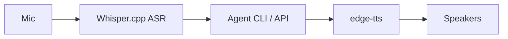

# Voice round-trip — roadmap

**Status:** *not yet implemented*. This document captures the
architecture, dependency footprint, and migration plan so the next
session can land the actual implementation in one focused commit.

The voice loop lets the user *speak* trade journal entries and *hear*
the agent's responses (post-trade narratives, daily summaries, alerts).
It runs on the same single-host deployment as the dashboard; all
processing is local to keep credentials, journal data, and audio off
third-party servers.

---

## 1. Why local?

* The journal contains real account balances + trade history -- not
  data we want to ship to a hosted ASR API.
* Latency: a 3-second round-trip on-device is competitive with cloud
  APIs once you account for HTTPS + queueing.
* Cost: zero ongoing per-minute cost; the up-front model download is
  one-time (~250 MB for Whisper small).

---

## 2. Architecture

```
+-------------------+        wav        +------------------+
|  Mic (PortAudio)  +------------------>|   Whisper.cpp    |
+-------------------+                   |   (ASR, local)   |
                                        +--------+---------+
                                                 |
                                              text
                                                 v
                                        +------------------+
                                        |  Agent CLI / API |
                                        | (journal write,  |
                                        |  query, etc.)    |
                                        +--------+---------+
                                                 |
                                              text
                                                 v
                                        +------------------+
                                        |   edge-tts       |
                                        |   (TTS, MS Edge) |
                                        +--------+---------+
                                                 |
                                              wav
                                                 v
                                        +------------------+
                                        |  Speakers        |
                                        +------------------+
```

Mermaid version:



The dashboard exposes `POST /voice/transcribe` (multipart wav) and
`POST /voice/speak` (text -> streamed wav). A simple long-press hotkey
in the desktop client sends mic audio to the first endpoint, prints
the transcript inline, and pipes the agent's reply through the second.

---

## 3. Dependencies

| Package | Purpose | Size | License | Notes |
| --- | --- | --- | --- | --- |
| `openai-whisper` (Python wrapper) | ASR | ~3 MB pkg, ~250 MB model | MIT | The model is fetched on first run; pin to `small.en` for English-only. |
| `whispercpp.py` *(alternative)* | ASR with C++ backend | ~1 MB pkg, model size identical | MIT | Faster on CPU; more setup. |
| `edge-tts` | TTS via Microsoft Edge | ~50 KB | GPL-3 | Works offline once the audio is generated; no API key. |
| `sounddevice` | Mic capture | ~200 KB | MIT | Requires PortAudio at the OS level (`brew install portaudio` on macOS). |
| `simpleaudio` | Playback (no GUI deps) | ~100 KB | MIT | Cross-platform 16-bit PCM. |

All four are pure-Python wheels except `sounddevice` which needs
PortAudio installed system-wide. Total disk impact ~250 MB
(dominated by the Whisper model).

The agent's existing `pyproject.toml` does **not** include any of
these; they go behind an extra:

```toml
[project.optional-dependencies]
voice = [
    "openai-whisper>=20231117",
    "edge-tts>=6.1",
    "sounddevice>=0.4",
    "simpleaudio>=1.0",
]
```

`pip install -e .[voice]` then opt-in installs the lot. The Docker
image stays small for users who don't need voice.

---

## 4. Module layout (next session)

```
agent/
  voice/
    __init__.py
    asr.py             # Whisper wrapper -- transcribe(wav_path) -> str
    tts.py             # edge-tts wrapper -- synthesize(text) -> wav bytes
    capture.py         # mic capture helpers
    playback.py        # speaker playback helpers
  dashboard/
    routes/
      voice.py         # /voice/transcribe + /voice/speak
scripts/
  voice_loop.py        # CLI: hold-to-talk REPL, calls asr -> agent -> tts
docs/
  voice_roadmap.md     # this file
tests/
  test_voice_asr.py    # mocks Whisper backend
  test_voice_tts.py    # mocks edge-tts
```

Each module is < 150 lines. The CLI script demonstrates the full
round-trip but can also be embedded as a tray app (out of scope here).

---

## 5. Implementation phases

### Phase 1 -- ASR only (1-2 hours)

* `agent/voice/asr.py::transcribe(audio_bytes_or_path) -> str`.
* Lazy-imports `whisper` so the rest of the agent boots without the
  optional dep.
* Tests stub the Whisper model and assert the wrapper passes through
  the recognised text.
* CLI: `scripts/transcribe.py file.wav` prints text to stdout.

### Phase 2 -- TTS only (1 hour)

* `agent/voice/tts.py::synthesize(text, voice='en-US-AriaNeural') -> bytes`.
* Tests mock `edge_tts.Communicate` and assert the wav bytes get
  buffered into memory.
* CLI: `scripts/speak.py "hello"` plays through speakers (or writes
  to a file with `--out`).

### Phase 3 -- Round-trip CLI

* `scripts/voice_loop.py`: hold-to-talk REPL.
* On press: capture mic, run ASR, dispatch transcript through the
  existing agent CLI commands (`journal add`, `report yesterday`,
  ...), synthesize the reply, play it back.
* Adds a `voice/transcribe` and `voice/speak` route to the dashboard
  for browser-side use (single hidden HTML page; no React).

### Phase 4 -- Push-to-talk hotkey + tray icon (stretch)

* Native global hotkey (`pynput`) -- start / stop capture.
* Tiny tray icon shows "listening" / "thinking" / "idle".
* Optional: snap into a menubar app via `rumps` on macOS.

---

## 6. Performance targets

| Step | Target on M1 / 12-core Linux |
| --- | --- |
| ASR (`small.en`) | < 1.5x real-time |
| TTS | < 0.4 s for 20-word reply |
| Agent dispatch | < 0.2 s |
| **Round-trip** | **< 3 s for a 5-second utterance** |

Anything beyond that (3-5 s) starts feeling laggy in conversation.
Whisper `tiny.en` halves the latency at the cost of a few extra word
errors; we'll benchmark and pick the default empirically.

---

## 7. Privacy + security

* All audio stays on-device. No cloud calls outside `edge-tts` (which
  *does* hit Microsoft for the synthesis step -- a reasonable trade-off
  given the cost of running a TTS model locally).
* If even Edge is too much external dependency, swap in `coqui-tts`
  (fully local) at the cost of larger install + slower synthesis.
* The dashboard endpoints must be bound to `127.0.0.1` by default to
  avoid leaking mic/audio to the network. The compose file already
  does this for the dashboard; we'll keep the same default for voice
  routes.

---

## 8. What's NOT in scope (yet)

* Wake-word ("hey trader") -- everything is push-to-talk for now.
* Speaker diarisation -- we assume one user.
* Multi-language ASR -- English-only.
* Real-time streaming ASR -- the audio is captured fully, *then*
  transcribed. Streaming Whisper is a phase-5 follow-up.
* On-device translation -- if the user speaks in non-English, we
  surface the raw Whisper transcript without translating.

---

## 9. Open questions

* macOS microphone permission flow inside Docker -- do we need a host
  agent? Most likely yes for local dev; production deployment runs on
  a Linux server with no mic anyway.
* How chatty should the agent be on every trade close vs. daily
  summary? Default: silent during live trading, voice-only on demand.
* Push-to-talk vs. always-listening with VAD -- defer to phase 4.
